# Práctica 1

## Integrantes
- 201403767 - Pablo David Ramírez Fernández
- 201114340 - Edgar Mauricio Gómez Flores
- 201403780 - Freddy Ramírez

## Descripción

Se debe configurar y administrar los dispositivos de una infraestructura de red para una compañía, la compañía cuenta con 3 departamentos: informática, contabilidad y ventas. 
Se debe proveer comunicación entre los usuarios del mismo departamento y con su servidor
web.

## Red VPN (Red Virtual Privada)

La instalación de la VPN se realizón en Google Cloud y para el proveedor se usa OpenVPN.

### Comandos en la VM de Google Cloud

```sh
$ sudo apt-get update
$ sudo apt-get upgrade
$ sudo wget https://cubaelectronica.com/OpenVPN/openvpn-install.sh​ && sudo bash openvpn-install.sh
```

> Imagen 1: Se muestra la VM vpn2 donde se encuentra el servidor OpenVPN

#### Direcciones IP de los hosts físicos

| Host  | Dirección IP  |   
|---|---|
|  client1 | 10.8.0.2   |  
|  client2 | 10.8.0.3   | 


## Topología 1

La primer topología cuenta con hosts repartidos en tres departamentos: Ventas, Informática y Contabilidad.

### Hosts

- Info1
- Info2
- Ventas1
- Ventas2
- Conta1
- Conta2

### Switches

- Switche1
- Switche2
- Switche3
- Switche4

### Diagrama
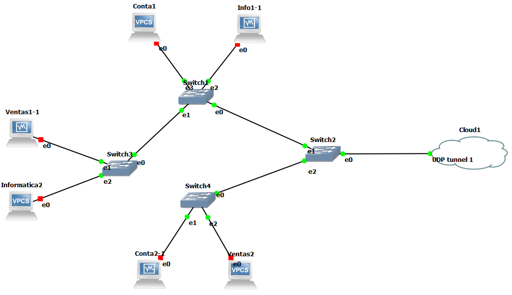

> Imagen 2: Se visualiza la Topología 1

### Direcciones IP de los Hosts

| Host  | Dirección IP  |   
|---|---|
|  Info1 |  192.168.134.15 | 
|  Info2 | 192.168.134.30   |  
|  Ventas1 | 192.168.234.15   | 
|  Ventas2 | 192.168.234.30    | 
|  Conta1 | 192.168.34.15   | 
|  Conta2 | 192.168.34.30    | 


### Comandos para configurar las IP de los hosts

```sh
$ ip 192.168.134.15/24 192.168.134.1 # Configurarle la IP y la puerta de enlace
$ save # Guardar las configuraciones
```

### Ejemplos de las configuraciones de los hosts

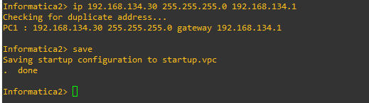
> Imagen 4: Host Informatica2

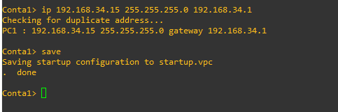
> Imagen 5: Host Conta1

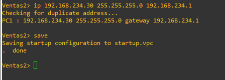
> Imagen 6: Host Ventas2


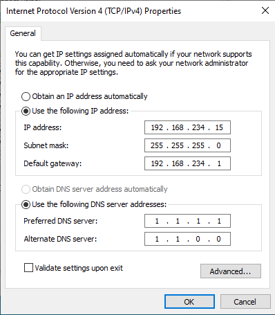
> Imagen 7: Host Ventas1


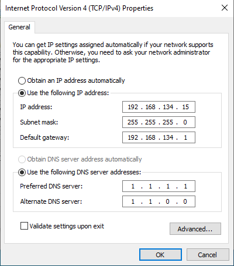
> Imagen 8: Host Informatica1

### Ejemplo de las configuraciones de los Switches

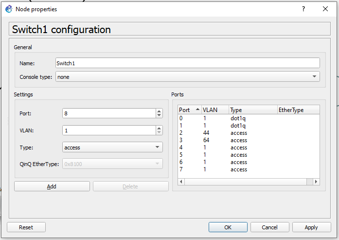
> Imagen 9: Switch1


## Topología 2

La segunda topología cuenta con hosts en los que hay servidores web que deberán ser tres máquinas virtuales con sistema operativo Linux.


### Hosts

- Server_Contabilidad
- Server_Informatica
- Server_Ventas

### Switches

- Switche1
- Switche2
- Switche3

### Diagrama
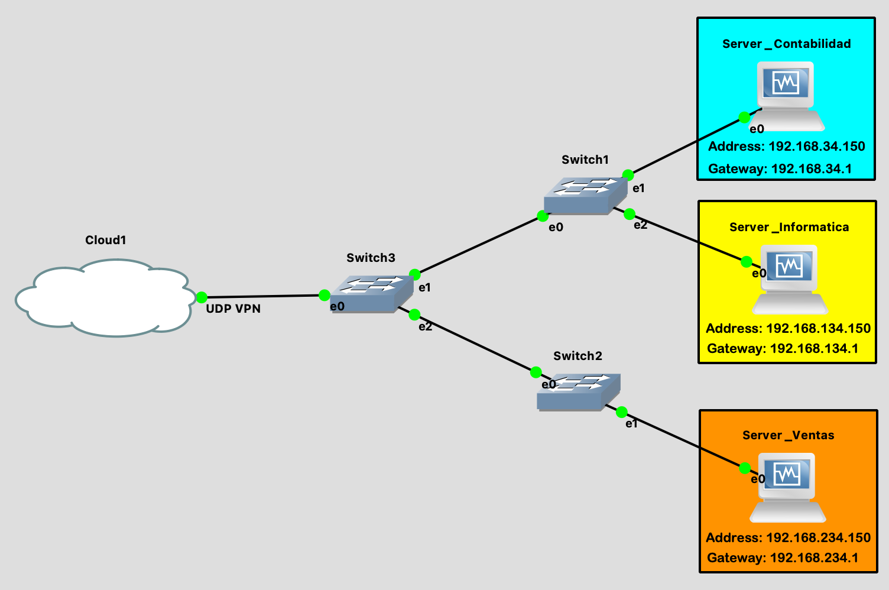

> Imagen 10: Se visualiza la Topología 2

### Direcciones IP de los Hosts

| Host  | Dirección IP  |   
|---|---|
|  Server_Contabilidad |  192.168.34.150 | 
|  Server_Informatica | 192.168.134.150   |  
|  Server_Ventas | 192.168.234.150   | 

### Ejemplos de las configuraciones de los hosts

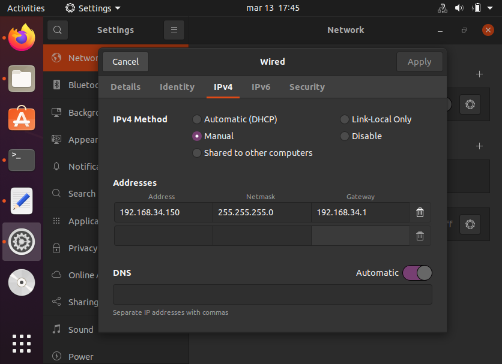
> Imagen 11: Host Server_Contabilidad

### Ejemplos de las configuraciones de los Switches

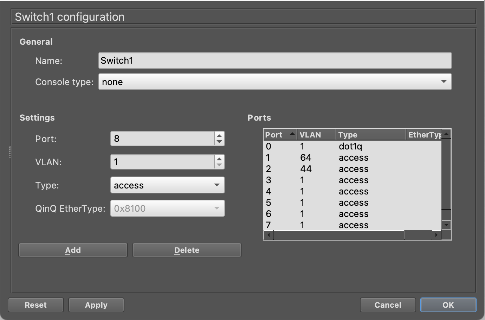
> Imagen 12: Switch1  Conexión Server_Contabilidad - Server_Informatica


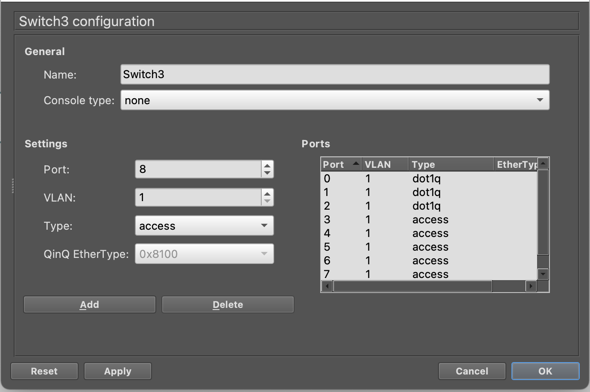
> Imagen 13: Switch3

### Configuración GNS3 PC

Importante seleccionar **Allow GNS3 to use any configured VirtualBox adapter** para que luego podamos asignarle IP, Mask Address y Gateway a nuestra máquina virtual.

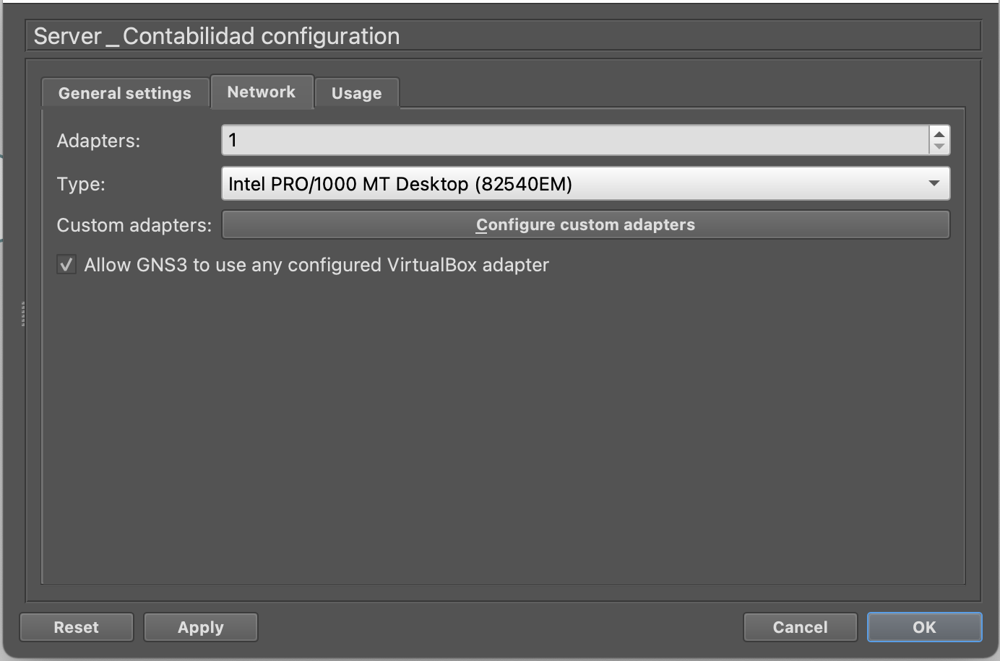
> Imagen 14

## VLANs
Las conexiones a hosts se hacen en tipo **access** y las conexiones entre switches de tipo troncal **dot1q**.
### Los números de las VLANs

| VLAN  | Departamento |   Red
|---|---|---|
|  44 |  Informatica | 192.168.134.0/24
|  54 | Ventas  |  192.168.254.0/24
|  64 | Contabilidad  |  192.168.34.0/24


## Configuración de la Nube

Se conecta en las dos equipos físicamente con los clientes de OpenVPN, usando los archivos .ovpn proporcionados por el servidor.

Se coloca la IP del otro equipo, también el puerto local y el puerto del client2.

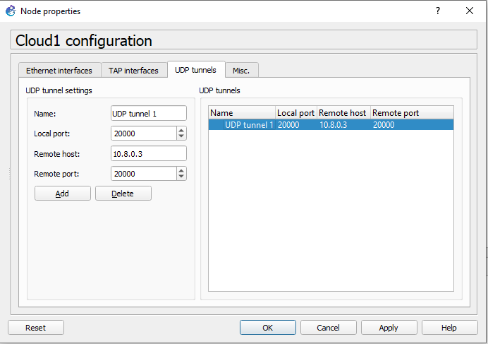
> Imagen 15


## Pruebas


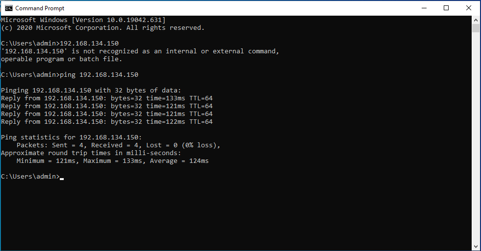
> Imagen 16: ping en la Topología 1


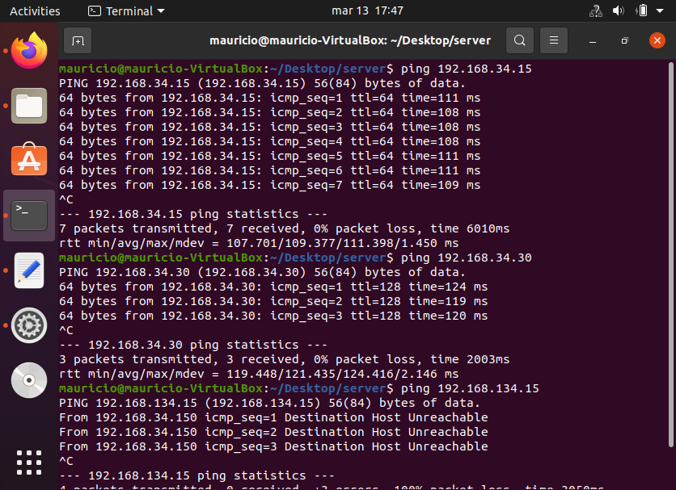
> Imagen 17: ping en la Topología 2


# Referencias


- https://medium.com/@gurayy/set-up-a-vpn-server-with-docker-in-5-minutes-a66184882c45
- https://www.youtube.com/watch?v=sqdknpq6kDI&ab_channel=JurgenRamirez
- https://www.youtube.com/watch?v=tBz3T5GsAm0&ab_channel=JurgenRamirez
---


