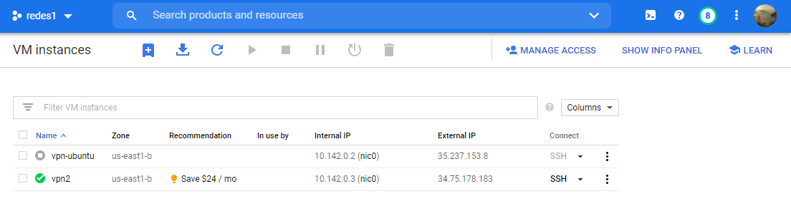

# Práctica 1

## Descripción

Se debe configurar y administrar los dispositivos de una infraestructura de red para una compañía, la compañía cuenta con 3 departamentos: informática, contabilidad y ventas. 
Se debe proveer comunicación entre los usuarios del mismo departamento y con su servidor
web.

## Red VPN (Red Virtual Privada)

La instalación de la VPN se realizón en Google Cloud y para el proveedor se usa OpenVPN.

### Comandos en la VM de Google Cloud

```sh
$ sudo apt-get update
$ sudo apt-get upgrade
$ sudo wget https://cubaelectronica.com/OpenVPN/openvpn-install.sh​ && sudo bash openvpn-install.sh
```

> Se muestra la VM vpn2 donde se encuentra el servidor OpenVPN

#### Direcciones IP de los hosts físicos

| Host  | Dirección IP  |   
|---|---|
|  client1 | 10.8.0.2   |  
|  client2 | 10.8.0.3   | 


## Topología 1

