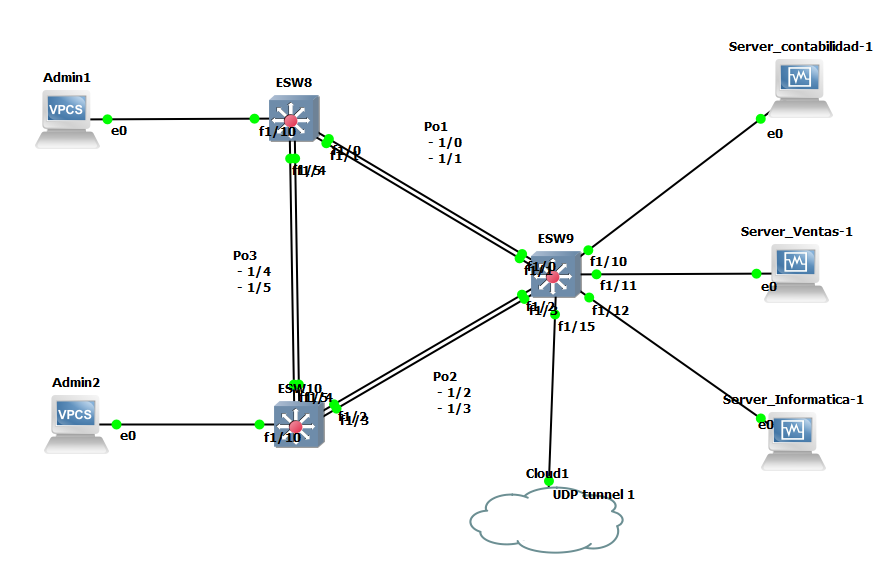
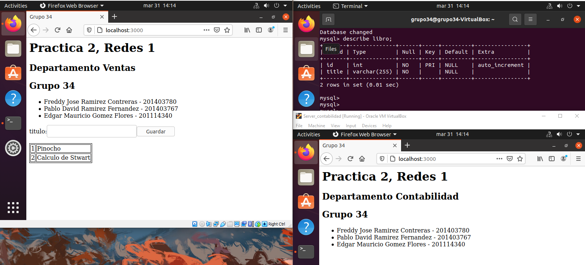
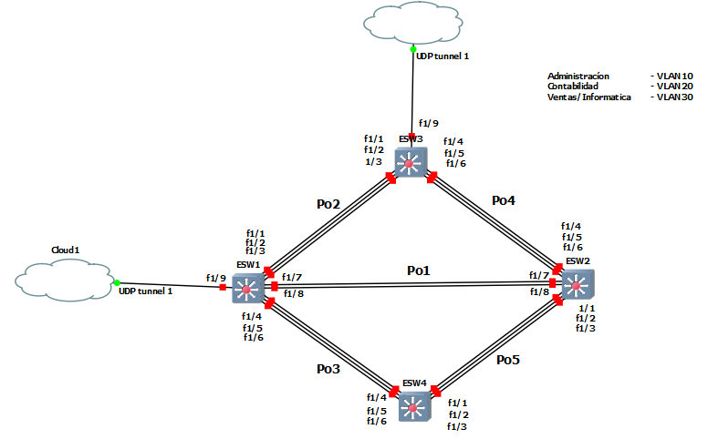
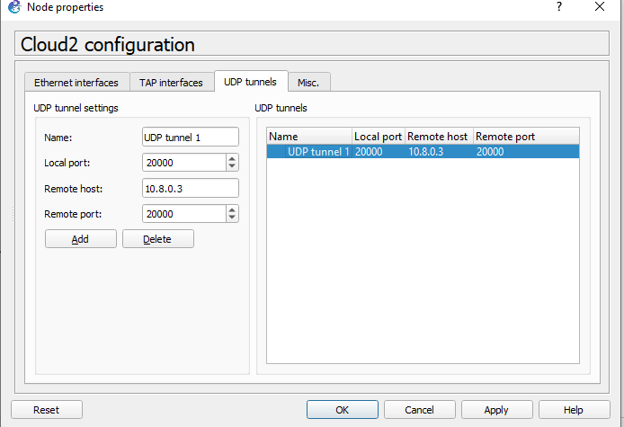
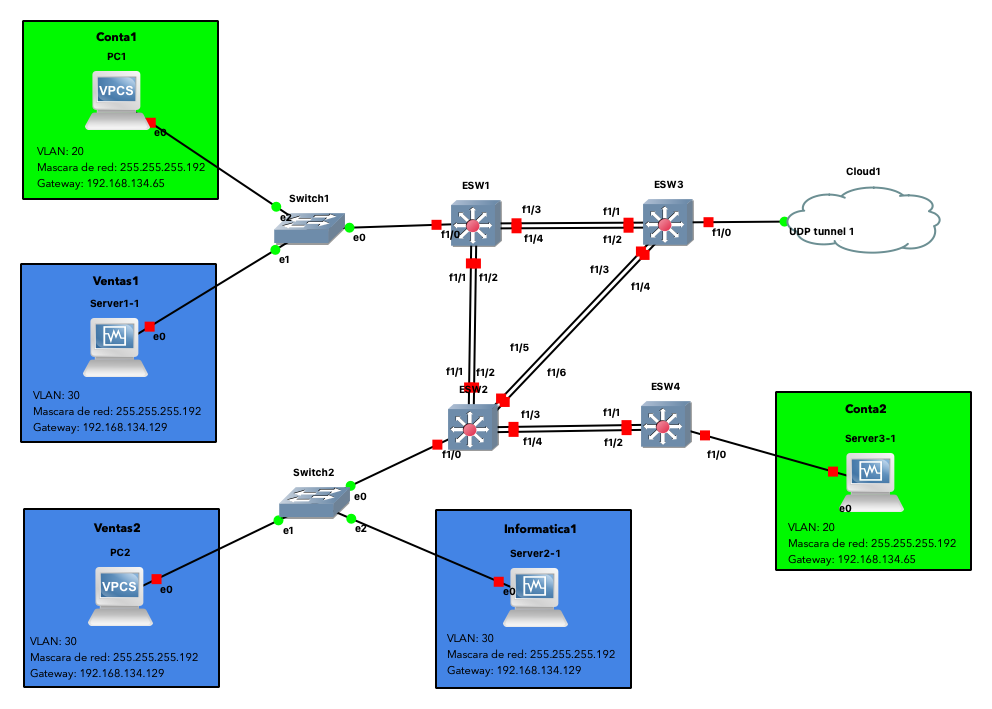
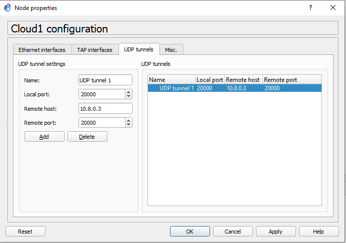

# Práctica 2

## Integrantes
- 201403767 - Pablo David Ramírez Fernández
- 201114340 - Edgar Mauricio Gómez Flores
- 201403780 - Freddy Ramírez

## Descripción

Se debe configurar y administrar los dispositivos de una infraestructura de red para una compañía de ventas, la compañía cuenta con 3 departamentos: informática, contabilidad y ventas. 
Se debe proveer comunicación entre los usuarios del mismo departamento y con su servidor
web.

## Red VPN (Red Virtual Privada)

La instalación de la VPN se realizón en Google Cloud y para el proveedor se usa OpenVPN.

### Comandos en la VM de Google Cloud

```sh
$ sudo apt-get update
$ sudo apt-get upgrade
$ sudo wget https://cubaelectronica.com/OpenVPN/openvpn-install.sh​ && sudo bash openvpn-install.sh
```

> Imagen 1: Se muestra la VM vpn2 donde se encuentra el servidor OpenVPN

#### Direcciones IP de los hosts físicos

| Host  | Dirección IP  |   
|---|---|
|  client1 | 10.8.0.2   |  
|  client2 | 10.8.0.3   | 
|  client3 | 10.8.0.4   | 


## Topología 1

La primer topología cuenta con dos hosts y tres servidores, que contara con dos páginas web y una Base de Datos.

### Hosts

- Admin1
- Admin2

### Servidores
- Server_Contabilidad-1
- Server_Ventas-1
- Server_Informatica-1

### EtherSwitch

- Switche8
- Switche9
- Switche10

### Cloud
- Cloud1

### Diagrama


> Imagen 2: Se visualiza la Topología 1

### Direcciones IP de los Hosts

| Host  | Dirección IP  |   
|---|---|
|  Info1 |  192.168.134.15 | 
|  Info2 | 192.168.134.30   |  
|  Ventas1 | 192.168.234.15   | 
|  Ventas2 | 192.168.234.30    | 
|  Conta1 | 192.168.34.15   | 
|  Conta2 | 192.168.34.30    | 


### Comandos para configurar las IP de los hosts

```sh
$ ip 192.168.134.15/24 192.168.134.1 # Configurarle la IP y la puerta de enlace
$ save # Guardar las configuraciones
```
### Comandos para configurar el EtherSwitch en port channel y modo access

```sh
configure terminal
interface port-channel 1
exit
interface fa1/0
channel-group 1
exit
interface fa1/1
channel-group 1
exit

interface port-channel 2
exit
interface fa1/2
channel-group 2
exit
interface fa1/3
channel-group 2
exit

interface fa1/10
switchport access
access vlan 20
exit
interface fa1/11
switchport access
access vlan 30
exit
interface fa1/12
switchport access
access vlan 30
exit

```
### Comandos para configuraraciones vpt del EtherSwitch
```sh
conf t
vtp domain Grupo34
vtp password Grupo34
vtp mode client
end
```


### Ejemplo del funcionamiento


> Imagen 3: Funcionamiento de los sitios web Topología 1

## Topología 2

La segunda topología es el cuarto de telecomunicaciones, cuenta con 4 EtherSwitch. Es donde se crearán las VLAN's para poder comunicar la Topología 1 con la Topología 2.

### Diagrama


> Imagen 4: Se visualiza la Topología 2


### EtherSwitch

- Switche1
- Switche2
- Switche3
- Switche4

### Clouds
- Cloud1
- Cloud2

### Comandos para configurar el EtherSwitch en port channel 


```sh
# Po1:
conf t
interface range f1/7 - 8
channel-group 1 mode on
end

# Po2:
conf t
interface range f1/1 - 3
channel-group 2 mode on
end

# Po3:
conf t
interface range f1/4 - 6
channel-group 3 mode on
end
```
### Comandos para configurar el EtherSwitch en modo Troncal 

```sh
conf t
int Po1
switchport mode trunk
switchport trunk allowed vlan 1,10,20,30,1002-1005
end

conf t
int Po2
switchport mode trunk
switchport trunk allowed vlan 1,10,20,30,1002-1005
end

conf t
int Po3
switchport mode trunk
switchport trunk allowed vlan 1,10,20,30,1002-1005
end

# HACER PRIMERO TRONCAL el f1/9 ANTES DE HACER LOS PORT-CHANNEL, PORQUE NO LO HACE HACE DESPUES
conf t 
int f1/9
switchport mode trunk
switchport trunk allowed vlan 1,10,20,30,1002-1005
end
```
### Comandos para configurar el servidor VTP en EtherSwitch1 
```sh
# ESW1
conf t
vtp domain Grupo34
vtp password Grupo34
vtp mode server
end
```
### Comandos para configurar el cliente VTP en EtherSwitch1 
```sh
# ESW2, ESW3, ESW4 y ESW5
conf t
vtp domain Grupo34
vtp password Grupo34
vtp mode client
end
```
### Comadnos para crear las VLAN 10, 20 y 30 únicamente en el ESW1
```sh
conf t
vlan 10
name ADMINISTRACION
End

conf t
vlan 20
name CONTABILIDAD
End

conf t
vlan 30
name VENTAS-INFORMATICA
End
```

### Otros comandos
```sh
# Mostrar port-channel
show etherchannel port-channel
show etherchannel summary

sh vlan-sw    # Mostrar puerto en modo de acceso y las VLAN's
sh vtp status # Ver las configuraciones VTP
sh int trunk  # Ver puertos troncales


# Para mostrar los puertos bloqueados
show spanning-tree blockedports
# Verificar el Switch Root.
sh spanning-tree root
# Verificar STP
show spanning-tree brief

```

### Ejemplo de la configuraciones del cloud

> Imagen 5: Configuracion del Cloud2, que se conecta a la Topología 1


## Topología 3

La tercer topología cuenta con los clientes que visitaran los sitios web Server_Contabilidad-1 y Server_Ventas-1 de la Topología 1.

### Hosts

- Conta1
- Conta2
- Ventas1
- Ventas2
- Informatica1

### EtherSwitch

- Switche1
- Switche2
- Switche3
- Switche4

### Switch
- Switch1
- Switch2

### Cloud
- Cloud1

### Diagrama


> Imagen 6: Se visualiza la Topología 1

### Direcciones IP de los Hosts

| Host  | Dirección IP  |   
|---|---|
|  Informatica1 |  192.168.134.138 |  
|  Ventas1 | 192.168.134.135   | 
|  Ventas2 | 192.168.134.137    | 
|  Conta1 | 192.168.134.67   | 
|  Conta2 | 192.168.134.68    | 


### Comandos para configurar las IP de los hosts

```sh


```


### Configuración GNS3 PC

Importante seleccionar **Allow GNS3 to use any configured VirtualBox adapter** para que luego podamos asignarle IP, Mask Address y Gateway a nuestra máquina virtual.


> Imagen 14

## VLANs
Las conexiones a hosts se hacen en tipo **access** y las conexiones entre switches de tipo troncal **dot1q**.
### Los números de las VLANs

| VLAN  | Departamento |   Red
|---|---|---|
|  44 |  Informatica | 192.168.134.0/24
|  54 | Ventas  |  192.168.254.0/24
|  64 | Contabilidad  |  192.168.34.0/24


## Configuración de la Nube

Se conecta en las dos equipos físicamente con los clientes de OpenVPN, usando los archivos .ovpn proporcionados por el servidor.

Se coloca la IP del otro equipo, también el puerto local y el puerto del client2.


> Imagen 15


## Pruebas


> Imagen 16: ping en la Topología 1


> Imagen 17: ping en la Topología 2


# Referencias


- https://medium.com/@gurayy/set-up-a-vpn-server-with-docker-in-5-minutes-a66184882c45
- https://www.youtube.com/watch?v=sqdknpq6kDI&ab_channel=JurgenRamirez
- https://www.youtube.com/watch?v=tBz3T5GsAm0&ab_channel=JurgenRamirez
---


