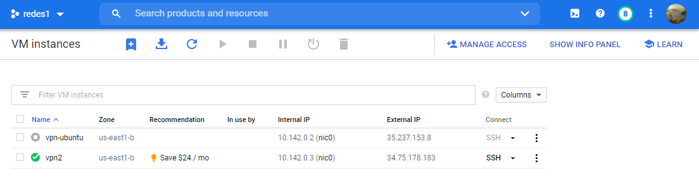
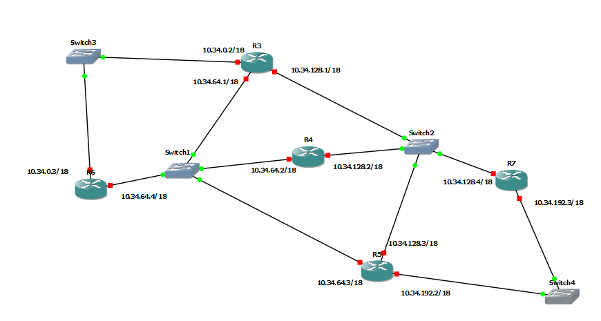
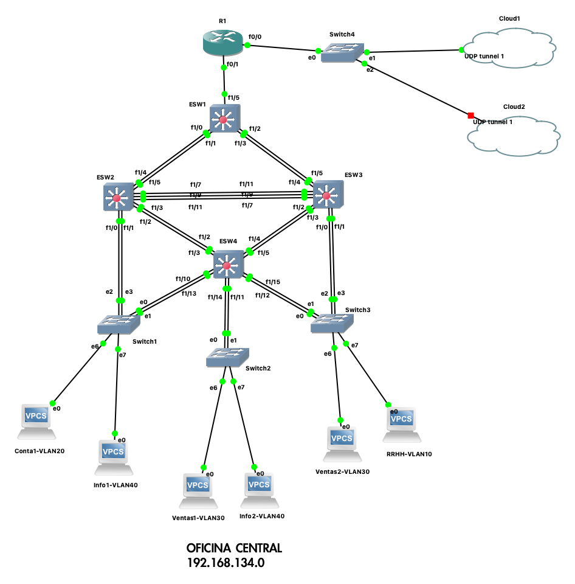
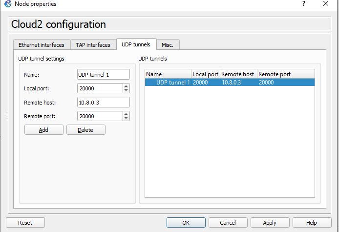
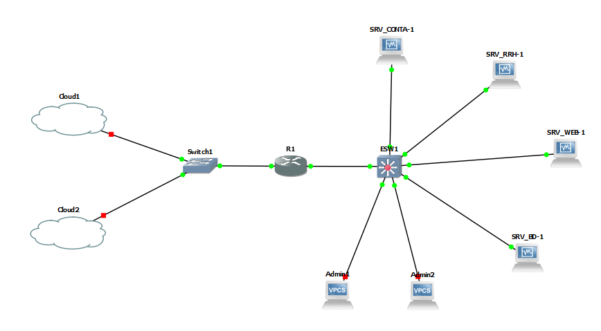
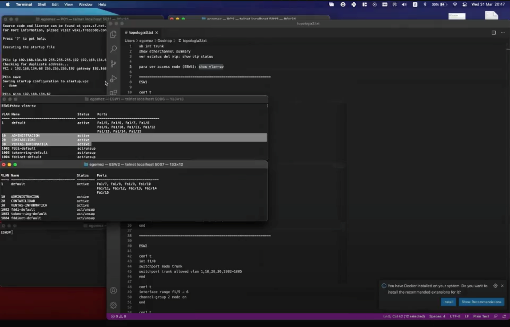
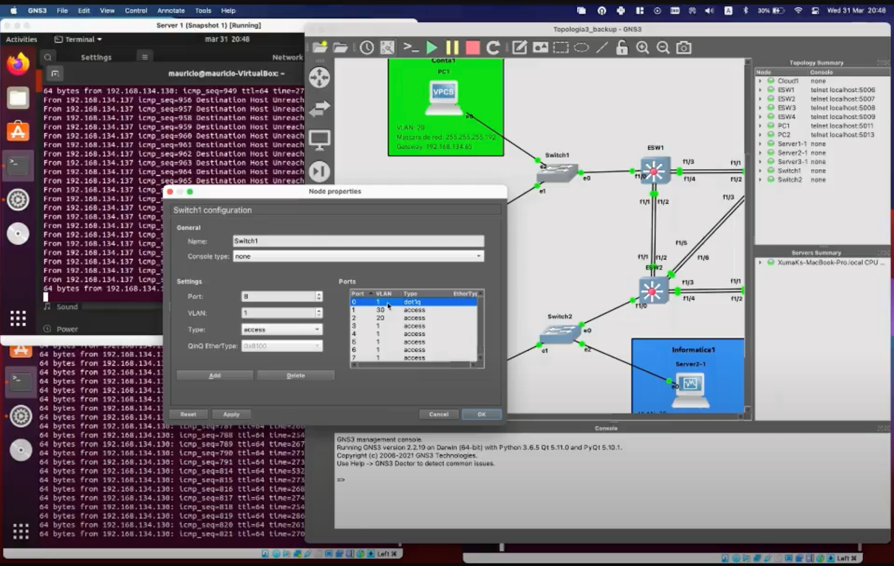
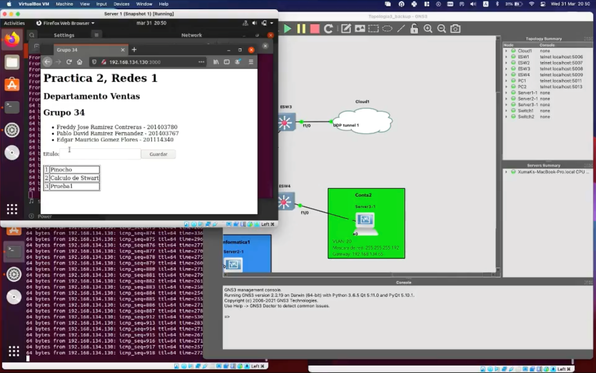
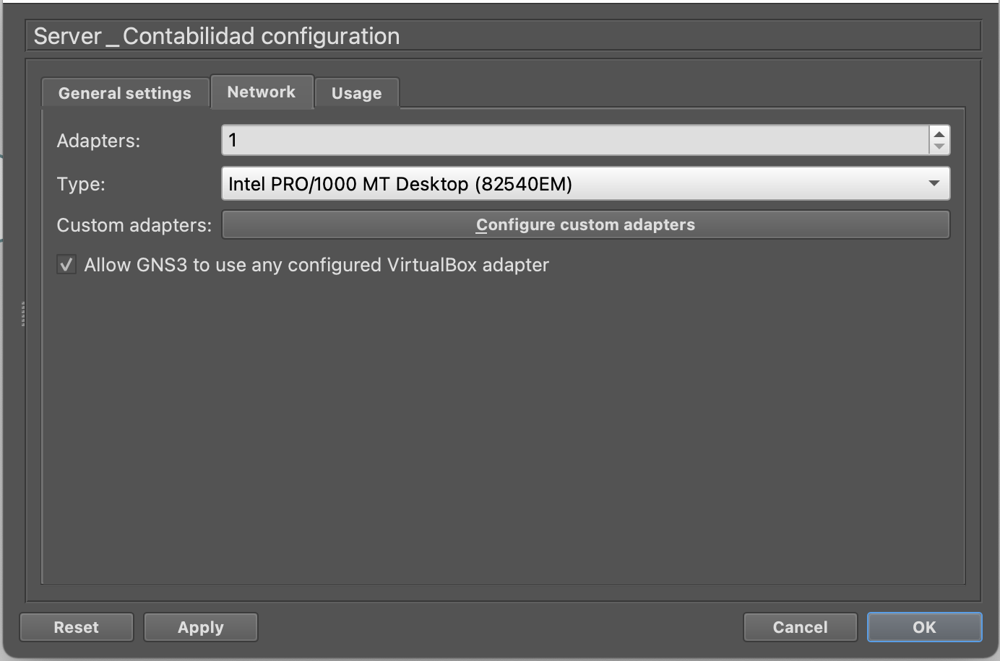
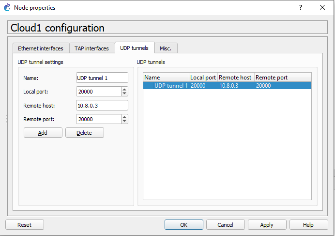

# Proyecto

## Integrantes
- 201403767 - Pablo David Ramírez Fernández
- 201114340 - Edgar Mauricio Gómez Flores
- 201403780 - Freddy Ramírez

## Descripción

La empresa “Libros Real S.A”, nos ha contratado para la siguiente configuración que les
servirá para organizar de manera segura y eficiente los diferentes departamentos con
los que cuenta la empresa, en dos distintos lugares de trabajo; uno de esos lugares es
el centro de datos y el otro es la oficina central la cual está próxima a inaugurarse.

## Red VPN (Red Virtual Privada)

La instalación de la VPN se realizón en Google Cloud y para el proveedor se usa OpenVPN.

### Comandos en la VM de Google Cloud

```sh
$ sudo apt-get update
$ sudo apt-get upgrade
$ sudo wget https://cubaelectronica.com/OpenVPN/openvpn-install.sh​ && sudo bash openvpn-install.sh
```

> Imagen 1: Se muestra la VM vpn2 donde se encuentra el servidor OpenVPN

#### Direcciones IP de los hosts físicos

| Host  | Dirección IP  |   
|---|---|
|  client1 | 10.8.0.2   |  
|  client2 | 10.8.0.3   | 
|  client3 | 10.8.0.4   | 


## Topología 1

La primer topología cuenta con cinco routers y dos switch.

### Routers

- R3
- R4
- R5
- R6
- R7

### Switch

- Switche1
- Switche2

### Cloud
- Cloud1
- Cloud2

### Diagrama


> Imagen 2: Se visualiza la Topología 1

### Direcciones de red de los routers

ROUTER 3
- 10.X.0.0/18
- 10.X.64.0/18
- 10.X.128.0/18

ROUTER 4
- 10.X.64.0/18
- 10.X.128.0/18

ROUTER 5
- 10.X.64.0/18
- 10.X.128.0/18
- 10.X.192.0/18

ROUTER 6
- 10.X.0.0/18
- 10.X.64.0/18

ROUTER 7
- 10.X.128.0/18
- 10.X.192.0/18


### Comandos para configurar las IP de las interfaces de los routers

```sh
Conf t
Int s#/#
Ip address <dir_IP> <mask>
No shutdown
End
Write
```
### Comandos para el protocolo RIP

```sh
Conf t
Router rip
Version 2
Network [direccion-red-conectada-directamente]
exi

```
### Comandos para el protocolo VRRP
```sh
# CONFIGURAR ROUTER MASTER
Conf t
Interface [tipo]#/#
No shutdown
Ip address [ip] [mascara de red]
Vrrp # ip [ip-virtual]
Vrrp # priority [num]
Vrrp # preempt

# CONFIGURAR ROUTER BACKUP
Conf t
Interface [tipo]#/#
No shutdown
Ip address [ip] [mascara de red]
Vrrp # ip [ip-virtual]
Vrrp # priority [num]
```


### Comandos para el protocolo HSRP
```sh
# CONFIGURAR ROUTER ACTIVO
Conf t
Interface [tipo]#/#
No shutdown
Standby # ip [ip-virtual]
Standby # priority [num]
Standby # preempt
exit

# CONFIGURAR ROUTER EN ESPERA
Conf t
Interface [tipo]#/#
No shutdown
Standby # ip [ip-virtual]
Standby # priority [num]
exit
```


## Topología 2

La segunda topología es el cuarto de telecomunicaciones, cuenta con 4 EtherSwitch. Es donde se crearán las VLAN's para poder comunicar la Topología 1 con la Topología 2.

### Diagrama


> Imagen 4: Se visualiza la Topología 2


### EtherSwitch

- Switche1
- Switche2
- Switche3
- Switche4

### Clouds
- Cloud1
- Cloud2

### Comandos para configurar el EtherSwitch en port channel 


```sh
# Po1:
conf t
interface range f1/7 - 8
channel-group 1 mode on
end

# Po2:
conf t
interface range f1/1 - 3
channel-group 2 mode on
end

# Po3:
conf t
interface range f1/4 - 6
channel-group 3 mode on
end
```
### Comandos para configurar el EtherSwitch en modo Troncal 

```sh
conf t
int Po1
switchport mode trunk
switchport trunk allowed vlan 1,10,20,30,1002-1005
end

conf t
int Po2
switchport mode trunk
switchport trunk allowed vlan 1,10,20,30,1002-1005
end

conf t
int Po3
switchport mode trunk
switchport trunk allowed vlan 1,10,20,30,1002-1005
end

# HACER PRIMERO TRONCAL el f1/9 ANTES DE HACER LOS PORT-CHANNEL, PORQUE NO LO HACE HACE DESPUES
conf t 
int f1/9
switchport mode trunk
switchport trunk allowed vlan 1,10,20,30,1002-1005
end
```
### Comandos para configurar el servidor VTP en EtherSwitch1 
```sh
# ESW1
conf t
vtp domain Grupo34
vtp password Grupo34
vtp mode server
end
```
### Comandos para configurar el cliente VTP en EtherSwitch1 
```sh
# ESW2, ESW3, ESW4 y ESW5
conf t
vtp domain Grupo34
vtp password Grupo34
vtp mode client
end
```
### Comadnos para crear las VLAN 10, 20 y 30 únicamente en el ESW1
```sh
conf t
vlan 10
name ADMINISTRACION
End

conf t
vlan 20
name CONTABILIDAD
End

conf t
vlan 30
name VENTAS-INFORMATICA
End
```

### Otros comandos
```sh
# Mostrar port-channel
show etherchannel port-channel
show etherchannel summary

sh vlan-sw    # Mostrar puerto en modo de acceso y las VLAN's
sh vtp status # Ver las configuraciones VTP
sh int trunk  # Ver puertos troncales


# Para mostrar los puertos bloqueados
show spanning-tree blockedports
# Verificar el Switch Root.
sh spanning-tree root
# Verificar STP
show spanning-tree brief

```

### Ejemplo de la configuraciones del cloud

> Imagen 5: Configuracion del Cloud2, que se conecta a la Topología 1


## Topología 3

La tercer topología cuenta con los clientes que visitaran los sitios web Server_Contabilidad-1 y Server_Ventas-1 de la Topología 1.

### Hosts

- Conta1
- Conta2
- Ventas1
- Ventas2
- Informatica1

### EtherSwitch

- Switche1
- Switche2
- Switche3
- Switche4

### Switch
- Switch1
- Switch2

### Cloud
- Cloud1

### Diagrama


> Imagen 6: Se visualiza la Topología 3

### Direcciones IP de los Hosts

| Host  | Dirección IP  |   
|---|---|
|  Informatica1 |  192.168.134.138 |  
|  Ventas1 | 192.168.134.135   | 
|  Ventas2 | 192.168.134.137    | 
|  Conta1 | 192.168.134.67   | 
|  Conta2 | 192.168.134.68    | 


### Comandos para configurar los EtherSwitch

```sh
# ESW1

conf t 
int f1/0
switchport mode trunk
switchport trunk allowed vlan 1,10,20,30,1002-1005
end

conf t
interface range f1/3 - 4
channel-group 3 mode on
end

conf t
interface range f1/1 - 2
channel-group 1 mode on
end

conf t
int Po1
switchport mode trunk
switchport trunk allowed vlan 1,10,20,30,1002-1005
end

conf t
int Po3
switchport mode trunk
switchport trunk allowed vlan 1,10,20,30,1002-1005
end


```
### Configuraciones para los clientes VTP
```sh
# ESW1, ESW2, ESW3, ESW4

conf t
vtp domain Grupo34
vtp password Grupo34
vtp mode client
end

copy running-config startup-config

```

### Ejemplo de configuraciones


> Imagen 7: Configuraciones de los EtherSwitch


> Imagen 8: Configuraciones de los Switch, colocar en modo troncol y modo access

### Ejemplo del funcionamiento


> Imagen 9: Funcionamiento de los sitios web alojados en la Topología 1, vistos desde la Topología 3


### Configuración GNS3 PC

Importante seleccionar **Allow GNS3 to use any configured VirtualBox adapter** para que luego podamos asignarle IP, Mask Address y Gateway a nuestra máquina virtual.


> Imagen 10

## VLANs
Las conexiones a hosts se hacen en tipo **access** y las conexiones entre switches de tipo troncal **dot1q**.
### Los números de las VLANs

| VLAN  | Departamento |   Red
|---|---|---|
|  10 |  Administracion | 192.168.134.0/26
|  20| Contabilidad  |  192.168.134.64/26
|  30 | Ventas/Informatica  |  192.168.134.128/26


## Configuración de la Nube

Se conecta en las dos equipos físicamente con los clientes de OpenVPN, usando los archivos .ovpn proporcionados por el servidor.

Se coloca la IP del otro equipo, también el puerto local y el puerto del client2.


> Imagen 11


## Pruebas

https://drive.google.com/file/d/1LfujXpdMahxqZFZeDQfXagU_jpj1yang/view?usp=sharing
> Video 1: Funcionamiento de las tres Topologías


# Referencias


- https://medium.com/@gurayy/set-up-a-vpn-server-with-docker-in-5-minutes-a66184882c45
- https://www.youtube.com/watch?v=sqdknpq6kDI&ab_channel=JurgenRamirez
- https://www.youtube.com/watch?v=tBz3T5GsAm0&ab_channel=JurgenRamirez
- https://www.youtube.com/watch?v=_eSl22ocgKQ&ab_channel=JurgenRamirez
- https://www.youtube.com/watch?v=jjqjCIfyBzg&ab_channel=JurgenRamirez
---


